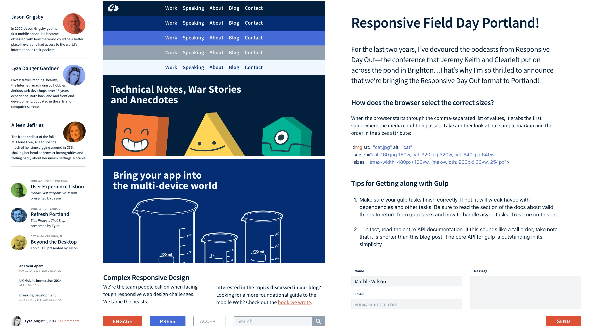

# Design Deliverables

Our process retires or streamlines many traditional design steps to promote transparency between internal and external teams while also decreasing the distance between what we design and what the user actually experiences.

The exact deliverables differ per project, but may include some or all of the following…

- TODO: Prioritization Exercises
- TODO: Personas
- [Mood Boards](#mood-boards)
- [Element Collages](#element-collages)
- TODO: Collaborative Sketches
- TODO: Wireframes
- TODO: Prototypes

## Mood Boards

A collage of images, textures, typography, colors or other materials, intended to evoke or visually summarize a particular style or concept.

Mood boards work best as part of the discovery phase of a project when brand characteristics are unknown, in flux or poorly applied to the web. They help internal and external teams get on the same page, establishing a shared frame of reference before we get in the weeds of more time-consuming, wholly original design tasks.

- **After:** Prioritization exercises, personas
- **Before:** Element collages
- **Timeframe:** 1–3 days per revision
- **Revisions:** Typically 1–3
- **Collaborators:** 1–2 designers + anyone who'd like to contribute!

### Tips

- Include materials you _know_ to be relevant as a starting point. This can include text notes summarizing priorities or characteristics, existing brand materials, or photographs of a physical location.
- Share mood boards while they're still in progress. This promotes understanding of the board's malleable nature and the process for creating it.
- Whenever possible, invite the client to collaborate on the mood board, either directly or by contributing comments/feedback.
- Aside from color/gradient swatches, cropping or lighting adjustments to photographic imagery, avoid creating original work for mood boards. This takes more time, removes discussion from the design process and encourages feedback on specific design decisions over the board's _overall_ appropriateness.
- Avoid presenting competing mood boards. While it's fine for a mood board to have complimentary sections to gauge interest in differing perspectives ("cool + modern," "bright + friendly"), simplifying a mood board review to "A versus B" can discourage discussion of the elements therein.

### Tools

Mood boards are traditionally assembled in-person by cutting out pieces of magazines or other printed materials, then collaging them on matte board or some other surface. At Cloud Four we tend to use digital tools instead. This helps us collaborate more seamlessly with remote teams while also referencing more relevant digital imagery.

- [InVision Boards](https://www.invisionapp.com/blog/boards-share-design-inspiration-assets/)
- [Niice](https://niice.co/)
- [Pinterest](https://www.pinterest.com/)

### Further Reading

- [Cloud Four: Mood Boards (Neither Bored Nor Moody)](https://cloudfour.com/thinks/mood-boards/)

## Element Collages

A collage of original but disparate design elements meant to demonstrate ideas without committing to a particular layout. As originator [Dan Mall](http://v3.danielmall.com/articles/rif-element-collages/) put it:

> A full comp often requires ideas to be fully realized. An element collage allows me to document a thought at any state of realization and move on to the next.

At the beginning of a project, element collages bridge the gap between explorational exercises like mood boards and more fleshed-out deliverables like in-browser mockups and prototypes. They're an ideal deliverable for figuring out foundational colors, typography, line weights and other design elements that can carry into the foundational CSS for in-browser mockups.

Throughout a project, they may be used more informally to explore ideas and inform prototypes.

- **After:** Mood boards
- **Before:** Prototypes
- **Timeframe:** 1–3 days per revision
- **Revisions:** Typically 2–4
- **Collaborators:** Ideally 2 or more designers work in parallel to create complimentary collages, eventually unifying their approach prior to prototyping. While prototyping, they can be created as simple one-off explorations (as needed).

### Tips

- Don't try to design every possible pattern in your collage. Instead, focus on elements you have an instinct to explore that could inform future patterns.
- Avoid composing elements of your collage in a manner that suggests a complete "page," which will disrupt the viewer's ability to critique the elements therein. If you find yourself unable to prevent this, it may be time to split your collage into separate images or artboards.
- If you have an idea for animation or interaction, don't be afraid to use [blur](http://v3.danielmall.com/articles/rif-element-collages/rif-element-collage-sample.png), [gesture overlays](https://www.lukew.com/ff/entry.asp?1071) or other visual techniques to communicate that intent in an efficient way.
- If working in parallel, freely <del>steal</del> <ins>borrow</ins> from your collaborators. Let every team member's work inform and strengthen the overall vision. Share your source files, messy layers and all.
- If multiple designers end up pursuing very similar design directions, branch off by applying that direction to different elements.

### Tools

We love designing in-browser, but it's usually a better idea to do looser explorations in a more free-form tool. Not having to worry about markup, box models or even responsive design considerations at this stage helps maintain a sense of play and inventiveness in our work. This helps us avoid designing [the same interface over and over](http://www.novolume.co.uk/blog/all-websites-look-the-same/).

- [Sketch](https://www.sketchapp.com/)
- [Adobe XD](http://www.adobe.com/products/experience-design.html)
- [Adobe Photoshop](http://www.adobe.com/products/photoshop.html)
- [Figma](https://www.figma.com/)

### Further Reading

- [Dan Mall: Element Collages](http://v3.danielmall.com/articles/rif-element-collages/)
- [Cloud Four: Element Collages… are FUN!](https://cloudfour.com/thinks/element-collages-are-fun/)