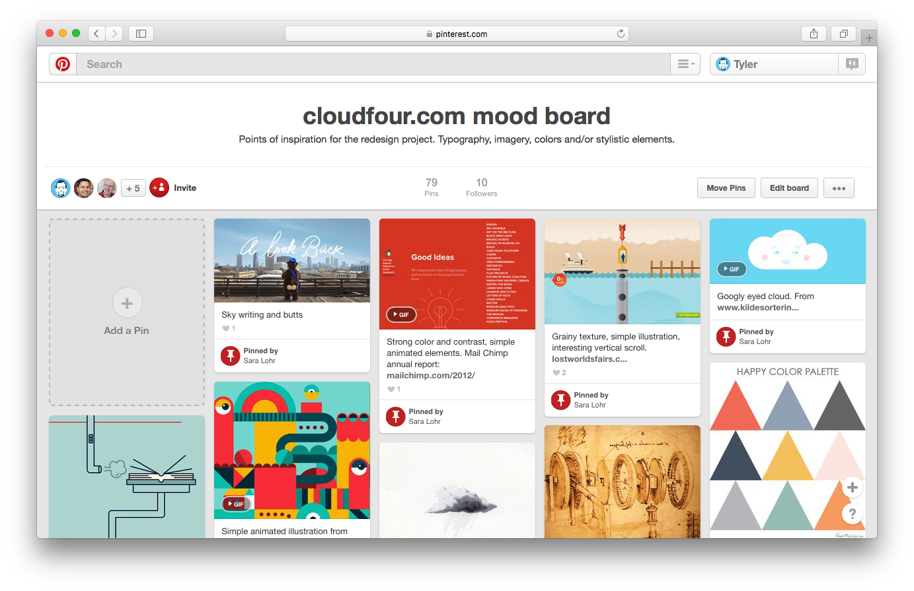

# Design Deliverables

Our process retires or streamlines many traditional design steps to promote transparency between internal and external teams while also decreasing the distance between what we design and what the user actually experiences.

The exact deliverables differ per project, but may include some or all of the following…

- TODO: Prioritization Exercises
- TODO: Personas
- [Mood Boards](#mood-boards)
- TODO: Element Collages
- TODO: Collaborative Sketches
- TODO: Wireframes
- TODO: Prototypes

## Mood Boards

A collage of images, textures, typography, colors or other materials, intended to evoke or visually summarize a particular style or concept.

Mood boards work best as part of the discovery phase of a project when brand characteristics are unknown, in flux or poorly applied to the web. They help internal and external teams get on the same page, establishing a shared frame of reference before we get in the weeds of more time-consuming, wholly original design tasks.

- **After:** Prioritization exercises, personas
- **Before:** Element collages
- **Timeframe:** 1–2 days per revision
- **Revisions:** Typically 1–3
- **Collaborators:** 1–2 designers + anyone who'd like to contribute!

### Tips

- Include materials you _know_ to be relevant as a starting point. This can include text notes summarizing priorities or characteristics, existing brand materials, or photographs of a physical location.
- Share mood boards while they're still in progress. This promotes understanding of the board's malleable nature and the process for creating it.
- Whenever possible, invite the client to collaborate on the mood board, either directly or by contributing comments/feedback.
- Aside from color/gradient swatches, cropping or lighting adjustments to photographic imagery, avoid creating original work for mood boards. This takes more time, removes discussion from the design process and encourages feedback on specific design decisions over the board's _overall_ appropriateness.
- Avoid presenting competing mood boards. While it's fine for a mood board to have complimentary sections to gauge interest in differing perspectives ("cool + modern," "bright + friendly"), simplifying a mood board review to "A versus B" can discourage discussion of the elements therein.

### Tools

Mood boards are traditionally assembled in-person by cutting out pieces of magazines or other printed materials, then collaging them on matte board or some other surface. At Cloud Four we tend to use digital tools instead. This helps us collaborate more seamlessly with remote teams while also referencing more relevant digital imagery.

- [InVision Boards](https://www.invisionapp.com/blog/boards-share-design-inspiration-assets/)
- [Niice](https://niice.co/)
- [Pinterest](https://www.pinterest.com/)

### Further Reading

- [Cloud Four: Mood Boards (Neither Bored Nor Moody)](https://cloudfour.com/thinks/mood-boards/)