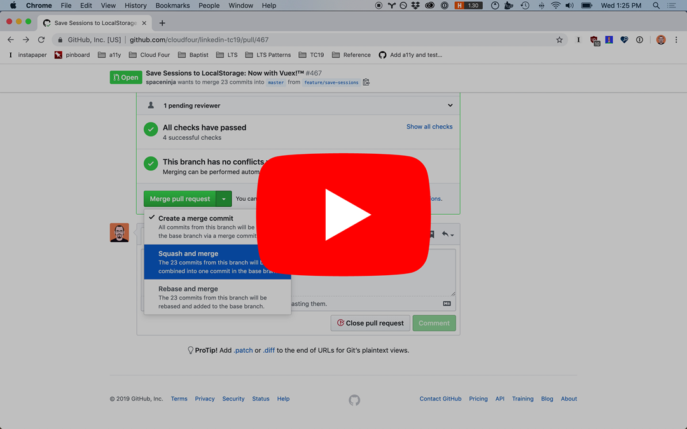
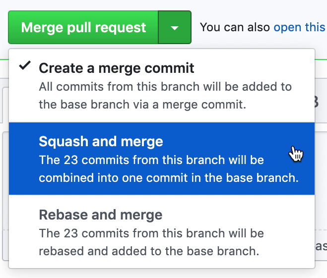

# How and Why to Squash Merge your Pull Requests

When merging a feature branch PR into master, we recommend you squash your commits into one (or just a few) commits. We do this to avoid having a messy history full of "fix typo", "lint fix" and "oops" commits. As a rule of thumb, most PRs should squash down to a single commit with a well-written commit message explaining why a change is happening.

On GitHub, you can use the "Squash and Merge" option when merging a commit to automatically squash all commits into one, with the option to rewrite the commit message.

From the command line, you can use the `git rebase -i` command, and then change `pick` to `s` for any commit you want to squash into the first. For more details, see the following resources.

## Resources

- [Thoughtbot: Git Interactive Rebase, Squash, Amend, and Other Ways of Rewriting History](https://thoughtbot.com/blog/git-interactive-rebase-squash-amend-rewriting-history)
- [Always Squash and Rebase Your Git Commits](https://blog.carbonfive.com/2017/08/28/always-squash-and-rebase-your-git-commits/)
- [Squash All Commits Related to a Single Issue into a Single Commit](https://github.com/todotxt/todo.txt-android/wiki/Squash-All-Commits-Related-to-a-Single-Issue-into-a-Single-Commit)
- [A Beginner's Guide to Squashing Commits with Git Rebase](https://medium.com/@slamflipstrom/a-beginners-guide-to-squashing-commits-with-git-rebase-8185cf6e62ec)
- [GitHub: Configuring commit squashing for pull requests](https://help.github.com/en/articles/configuring-commit-squashing-for-pull-requests)
